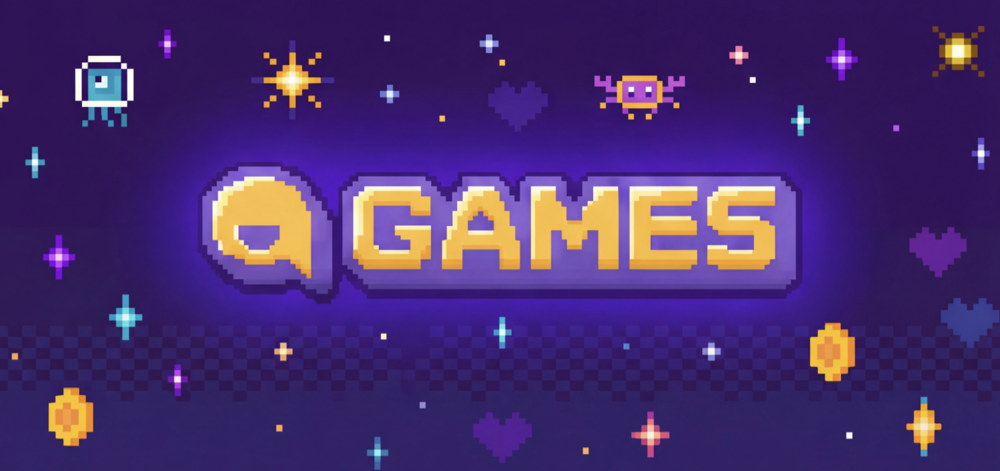

<div align="center">
  <h1>RPlay Games Unity SDK</h1>
  <p><a href="README.md">한국어</a> · <a href="README.en.md">English</a> · <strong>日本語</strong></p>
  <p>
    <a href="#動作要件"></a>
    <a href="https://github.com/r-play/rplay-games-unity-sdk/tree/v0.2.2"></a>
    <a href="#ライセンス"></a>
  </p>
  
  <p><a href="https://rplay.live/p/game">RPlay Games</a>と<a href="https://storyengine.live/p/game">StoryEngine</a>のログイン、ゲームデータ、リーダーボード、プラットフォームのコイン・クレジットAPIをUnityで利用するためのSDKです。</p>
</div>

## 目次

- [動作要件](#動作要件)
- [インストール](#インストール)
- [サンプルを実行](#サンプルを実行)
- [はじめに](#はじめに)
  - [Settingsアセットを作成](#1-settingsアセットを作成)
  - [ログインボタンを接続](#2-ログインボタンを接続)
- [SDKの状態とログイン](#sdkの状態とログイン)
- [ユーザー情報](#ユーザー情報)
- [ゲームデータの保存と読み込み](#ゲームデータの保存と読み込み)
- [リーダーボード](#リーダーボード)
- [RPlayコインとStoryEngineクレジット](#rplayコインとstoryengineクレジット)
- [レスポンスとエラー処理](#レスポンスとエラー処理)
- [ライセンス](#ライセンス)

## 動作要件

- Unity 2022.3 LTS 以上
- WebGL
- Windows、macOS、Linuxのデスクトップビルド

## インストール

1. Unityメニューから`Window > Package Manager`を開きます。
2. 左上の`+`ボタンを押し、`Install package from git URL...`を選択します。
3. 次のURLを入力して`Install`を押します。

```text
https://github.com/r-play/rplay-games-unity-sdk.git#v0.2.2
```

## サンプルを実行

すべてのAPIをすぐに確認するには、パッケージに含まれるAPI Playgroundを使用してください。

1. Package Managerで`RPlay Games SDK`を選択します。
2. `Samples`の`API Playground`で`Import`を押します。
3. Projectウィンドウで`Samples/RPlay Games SDK/0.2.2/API Playground`フォルダーを開きます。
4. `RPlayGamesApiPlayground`シーンを開き、Playボタンを押します。

サンプルにはテスト用の`GameOid`が設定されていますが、`Sdk Key`は空です。サンプルを実行するには、ご自身のゲームの`GameOid`と`SDKキー`に置き換えてください。

## はじめに

### 1. Settingsアセットを作成

1. RPlayでゲームを作成し、ゲーム管理画面を開きます。アドレスに`GameOid`が含まれています。
   `https://rplay.live/studio2/game/{GameOid}`
2. 同じ画面で`ゲームエンジン`を`Unity`に設定すると`Unity SDKキー`の項目が表示されます。`キーを表示`または`コピー`で値を確認します。
3. UnityのProjectウィンドウで右クリックし、`Create > RPlay > Games Settings`を選択します。
4. 作成された`RPlayGamesSettings`アセットの`Game Oid`と`Sdk Key`に確認した値を入力します。

`Unity SDKキー`の項目はゲームエンジンを`Unity`に設定したときのみ表示され、ゲームのオーナーとコラボレーターのみが確認できます。デスクトップ・モバイルビルドはこのキーがないとログインに失敗し、WebGLビルドはプラットフォームがトークンを直接注入するためキーを使用しません。

キーは設定アセットにそのまま保存されず難読化して保管されますが、ビルドを解析すれば抽出される可能性があります。キーだけであらゆる不正利用を防ぐことはできないため、リポジトリや画面共有で公開されないよう管理してください。

### 2. ログインボタンを接続

次のスクリプトをGameObjectに追加し、作成したSettingsアセットを`Settings`に割り当てます。その後、UI Buttonの`On Click()`に`Login`を登録してください。

```csharp
using System;
using RPlay.Games;
using UnityEngine;

public sealed class RPlayLoginButton : MonoBehaviour
{
    [SerializeField] private RPlayGamesSettings settings;

    public async void Login()
    {
        try
        {
            if (!RPlayGames.IsInitialized)
            {
                await RPlayGames.InitializeAsync(settings);
            }

            if (!RPlayGames.IsAuthenticated)
            {
                await RPlayGames.LoginAsync();
            }
            Debug.Log("RPlay Gamesへのログインが完了しました");
        }
        catch (Exception exception)
        {
            Debug.LogException(exception);
        }
    }

    public async void Logout()
    {
        try
        {
            await RPlayGames.LogoutAsync();
            Debug.Log("RPlay Gamesからのログアウトが完了しました");
        }
        catch (Exception exception)
        {
            Debug.LogException(exception);
        }
    }
}
```

Editorとデスクトップビルドでは、`LoginAsync()`を呼び出すとブラウザーが開きます。ユーザーがRPlayまたはStoryEngineでログインすると、SDKは選択されたプラットフォームを現在の実行セッション中保持します。

WebGLではRPlayゲームページのログイン情報を使用するため、別のブラウザーログイン画面は開きません。

## SDKの状態とログイン

ゲームAPIを呼び出す前に、SDKの初期化と認証を完了する必要があります。

| プロパティ | 型 | 説明 |
| --- | --- | --- |
| `RPlayGames.IsInitialized` | `bool` | SDKの初期化が完了しているかを示します。 |
| `RPlayGames.IsAuthenticated` | `bool` | ゲームAPIを呼び出すための認証情報をSDKが保持しているかを示します。 |
| `RPlayGames.ConnectedPlatform` | `RPlayPlatform?` | 現在接続されているプラットフォームです。ログイン前は`null`、ログイン後は`RPlay`または`StoryEngine`です。 |
| `RPlayGames.Settings` | `RPlayGamesSettings` | 初期化時に渡したSettingsアセットです。 |

| メソッド | 戻り値 | 説明 |
| --- | --- | --- |
| `InitializeAsync(settings)` | `Task` | `RPlayGamesSettings`を読み込み、SDKを準備します。同じSettingsで再度呼び出しても安全です。 |
| `LoginAsync()` | `Task` | ゲームAPIの認証を開始します。Editorとデスクトップではブラウザーログインを開き、WebGLではゲームページの認証を使用します。 |
| `LogoutAsync()` | `Task` | 現在の実行セッションのログインを終了し、SDKが保持する認証情報を削除します。 |

すべての非同期メソッドは、最後の引数として任意の`CancellationToken`を受け取ることができます。

## ユーザー情報

| メソッド | 戻り値 | 説明 |
| --- | --- | --- |
| `VerifyUserAsync()` | `Task<RPlayResponse>` | 現在のアカウントがこのゲームをプレイできるか確認します。 |
| `GetUserInfoAsync()` | `Task<RPlayUserInfo>` | ユーザー識別子、プラットフォーム、ニックネーム、コイン・クレジット残高を取得します。 |

```csharp
var user = await RPlayGames.GetUserInfoAsync();
user.EnsureSuccess();

Debug.Log($"ニックネーム: {user.Nickname}");
```

`RPlayUserInfo`の主なプロパティは次のとおりです。

| プロパティ | 型 | 説明 |
| --- | --- | --- |
| `UserOid` | `string` | プラットフォームのユーザー識別子です。 |
| `PlatformType` | `string` | レスポンスを提供したプラットフォームです。 |
| `Nickname` | `string` | 現在のユーザーのニックネームです。 |
| `MultiLangNick` | `IReadOnlyDictionary<string, string>` | 言語別のニックネームです。 |
| `CoinBalance` | `double` | RPlayコインの残高です。 |
| `CreditBalance` | `double?` | StoryEngineクレジットの残高です。RPlayアカウントでは`null`です。 |

現在接続されているプラットフォームは`RPlayGames.ConnectedPlatform`で確認できます。

ゲームのプレイ権限のみを確認する場合は`VerifyUserAsync()`を使用します。

```csharp
var access = await RPlayGames.VerifyUserAsync();
if (!access.Success)
{
    Debug.LogWarning($"プレイ権限の確認に失敗しました: {access.ErrorCode}");
}
```

## ゲームデータの保存と読み込み

`SetDataAsync()`で保存したデータはローカルデバイスではなく、ゲームとログイン中のプラットフォームアカウントごとにRPlayサーバーへ保存されます。同じゲームで同じプラットフォームアカウントにログインすると、後の実行セッションでも`LoadDataAsync()`で続きから読み込めます。

| メソッド | 戻り値 | 説明 |
| --- | --- | --- |
| `LoadDataAsync()` | `Task<RPlayGameData>` | 保存されたすべてのデータを`JObject`として読み込みます。`ToObject<T>()`で任意の型に変換できます。 |
| `LoadDataAsync<T>()` | `Task<RPlayGameData<T>>` | 保存されたすべてのデータを指定した型`T`で読み込みます。 |
| `RPlayGameData.ToObject<T>()` | `T` | `JObject`として読み込んだデータを指定した型`T`に変換します。 |
| `SetDataAsync(key, value)` | `Task<RPlayDataWriteResult>` | 指定した1つのキーを追加または上書きします。 |
| `SetDataAsync(data)` | `Task<RPlayDataWriteResult>` | オブジェクト内の複数フィールドをまとめて追加または上書きします。 |
| `DeleteDataAsync(key)` | `Task<RPlayDataWriteResult>` | 指定したキーと値を削除します。 |
| `DeleteAllDataAsync()` | `Task<RPlayResponse>` | 現在のユーザーのゲームデータをすべて削除します。リーダーボードの記録は保持されます。 |

```csharp
using Newtonsoft.Json;

public sealed class PlayerSave
{
    [JsonProperty("chapter")]
    public int Chapter { get; set; }

    [JsonProperty("hp")]
    public int Hp { get; set; }
}
```

```csharp
await RPlayGames.SetDataAsync("chapter", 3);
await RPlayGames.SetDataAsync(new { chapter = 3, hp = 80 });

var save = await RPlayGames.LoadDataAsync<PlayerSave>();
save.EnsureSuccess();

Debug.Log($"チャプター: {save.Data.Chapter}, HP: {save.Data.Hp}");

await RPlayGames.DeleteDataAsync("chapter");
await RPlayGames.DeleteAllDataAsync();
```

`RPlayGameData<T>.Data`には読み込んだデータが、`DataSize`には現在の保存データサイズが入ります。保存・削除後のサイズは`RPlayDataWriteResult.DataSize`でも確認できます。

`SetDataAsync(object)`は、渡したフィールドのみを既存データへ追加または上書きします。

## リーダーボード

| メソッド | 戻り値 | 説明 |
| --- | --- | --- |
| `SetScoreAsync(score)` | `Task<RPlayLeaderboardUpdateResult>` | 自分のリーダーボードスコアを指定した値に設定します。 |
| `IncrementScoreAsync(amount)` | `Task<RPlayLeaderboardUpdateResult>` | 現在のスコアに指定した値を加算します。 |
| `GetMyRankAsync()` | `Task<RPlayLeaderboardMeResult>` | 自分のスコアと現在の順位を読み込みます。 |
| `GetTopRanksAsync(limit = 50, offset = 0)` | `Task<RPlayLeaderboardPage>` | 上位順位をページ単位で読み込みます。 |
| `GetRanksAroundMeAsync(range = 5)` | `Task<RPlayLeaderboardAroundResult>` | 自分の順位を中心に前後のユーザー順位を読み込みます。 |

```csharp
await RPlayGames.SetScoreAsync(1200);
await RPlayGames.IncrementScoreAsync(50);

var mine = await RPlayGames.GetMyRankAsync();
var top = await RPlayGames.GetTopRanksAsync(limit: 20);
var around = await RPlayGames.GetRanksAroundMeAsync(range: 5);

mine.EnsureSuccess();
top.EnsureSuccess();
around.EnsureSuccess();
```

`GetTopRanksAsync()`の`limit`と`GetRanksAroundMeAsync()`の`range`は最大50です。

スコア変更結果は`RPlayLeaderboardUpdateResult.Entry`で確認できます。自分の順位は`RPlayLeaderboardMeResult.Rank`と`Entry`に含まれます。一覧レスポンスの`Entries`には、各ユーザーの`Rank`、`Score`、`UpdatedAt`、ニックネーム、プロフィール情報が含まれます。

## RPlayコインとStoryEngineクレジット

RPlayでは**コイン**、StoryEngineでは**クレジット**を使用します。SDKはログイン時に接続されたプラットフォームに基づいてコインまたはクレジットを自動選択するため、ゲーム側でプラットフォームを指定する必要はありません。

| メソッド | 戻り値 | 説明 |
| --- | --- | --- |
| `RequestChargeAsync()` | `Task<RPlayResponse>` | 接続中のプラットフォームのチャージ画面を開きます。レスポンスで画面のリクエストが成功したか確認できます。 |
| `ConsumeAsync(amount, itemName, options)` | `Task<RPlayConsumeResult>` | 指定したアイテムのコインまたはクレジット消費をリクエストし、取引結果と残高を返します。 |

チャージ画面を開くには、次のAPIを呼び出します。

```csharp
var charge = await RPlayGames.RequestChargeAsync();
charge.EnsureSuccess();
```

`RequestChargeAsync()`は、接続中のプラットフォームに合ったコインまたはクレジットのチャージ画面を開きます。

コインまたはクレジットを消費する際は、金額と表示するアイテム名を渡します。`amount`は両方のプラットフォームでRPlayコイン単位を入力します。RPlayでは指定したコイン数が消費され、StoryEngineではプラットフォームの換算基準に基づいてクレジットへ変換して消費されます。クレジット金額はSDKとサーバーが計算するため、ゲーム側で直接換算しないでください。

```csharp
var result = await RPlayGames.ConsumeAsync(
    amount: 10,
    itemName: "復活券",
    options: new RPlayConsumeOptions
    {
        ItemDescription = "現在の位置からプレイを続けます。",
        Metadata = new { stage = 7 }
    }
);

result.EnsureSuccess();
```

`RPlayConsumeOptions`で消費画面と一緒に渡す情報を設定できます。

| プロパティ | 型 | 説明 |
| --- | --- | --- |
| `SkipConfirmation` | `bool` | `true`の場合、消費確認や残高不足の案内を含むすべてのSDKポップアップを省略します。初期値は`false`です。 |
| `ItemDescription` | `string` | 消費確認画面に表示するアイテムの説明です。 |
| `Metadata` | `object` | 消費リクエストと一緒に送信するゲーム固有の追加情報です。JSONオブジェクトへ変換できる値を使用します。 |

消費に成功すると、`RPlayConsumeResult.TransactionId`に取引識別子が返されます。消費後の残高は、RPlayでは`RemainingCoins`、StoryEngineでは`RemainingCredits`で確認できます。

Editorとデスクトップビルドでは、SDKが消費確認と残高不足の案内を表示します。WebGLではゲームページのポップアップを使用します。

## レスポンスとエラー処理

APIレスポンスの`Success`でリクエストの成否を確認できます。失敗したレスポンスで`EnsureSuccess()`を呼び出すと`RPlayApiException`が発生します。

すべてのAPIレスポンスは`RPlayResponse`を継承し、次の共通プロパティを提供します。

| プロパティ | 型 | 説明 |
| --- | --- | --- |
| `Success` | `bool` | リクエストが成功したかを示します。 |
| `Status` | `string` | リクエストの処理状態です。 |
| `ErrorCode` | `string` | 失敗原因を識別するエラーコードです。 |
| `Message` | `string` | サーバーが返したエラーまたは案内メッセージです。 |
| `HttpStatusCode` | `long` | HTTPステータスコードです。 |
| `RawJson` | `string` | サーバーが返した元のJSON文字列です。 |
| `EnsureSuccess()` | `void` | `Success`が`false`の場合に`RPlayApiException`を発生させます。 |

```csharp
try
{
    var user = await RPlayGames.GetUserInfoAsync();
    user.EnsureSuccess();
}
catch (RPlayApiException exception)
{
    Debug.LogError($"RPlay Games APIエラー: {exception.ErrorCode}");
}
```

レスポンスを直接処理する場合は、`Success`、`Status`、`ErrorCode`、`Message`を使用してください。`RPlayApiException`では、`ErrorCode`、`HttpStatusCode`、`ResponseBody`から失敗情報を確認できます。

## ライセンス

Copyright (c) 2026 PLAX INC. このSDKは[MIT License](LICENSE.md)のもとで提供されます。
